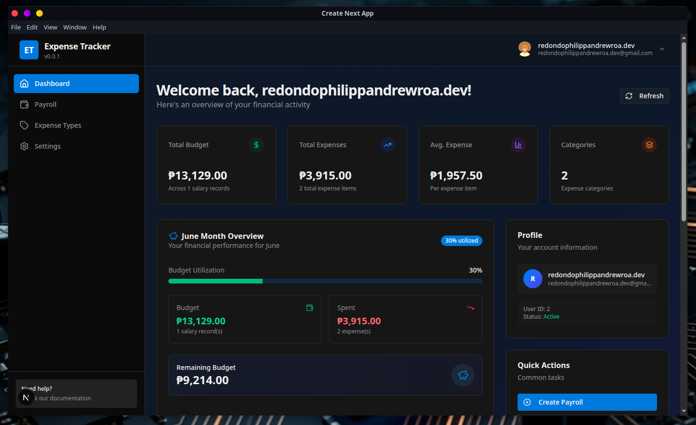
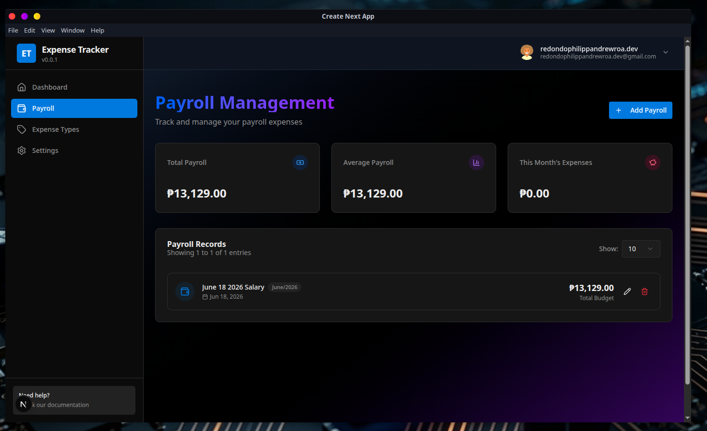
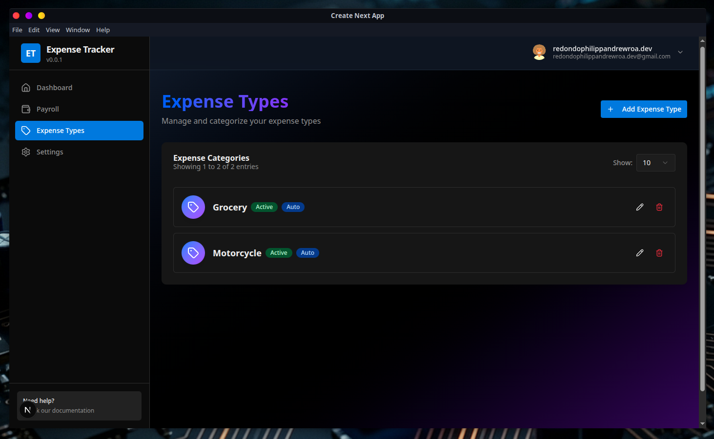
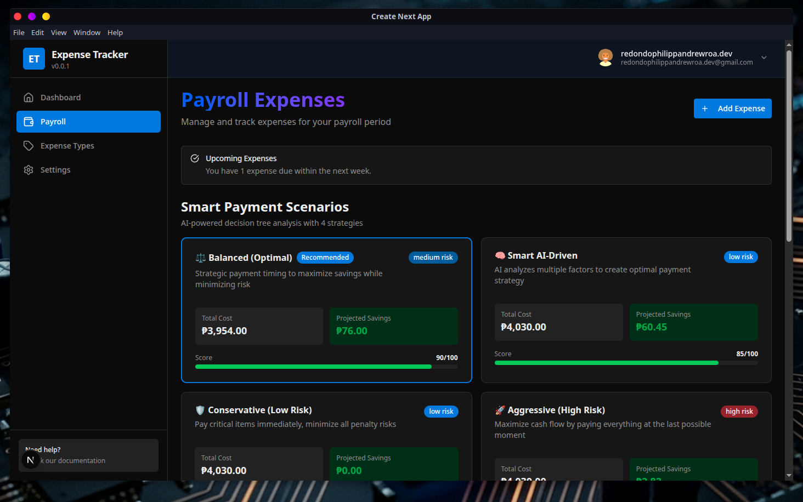
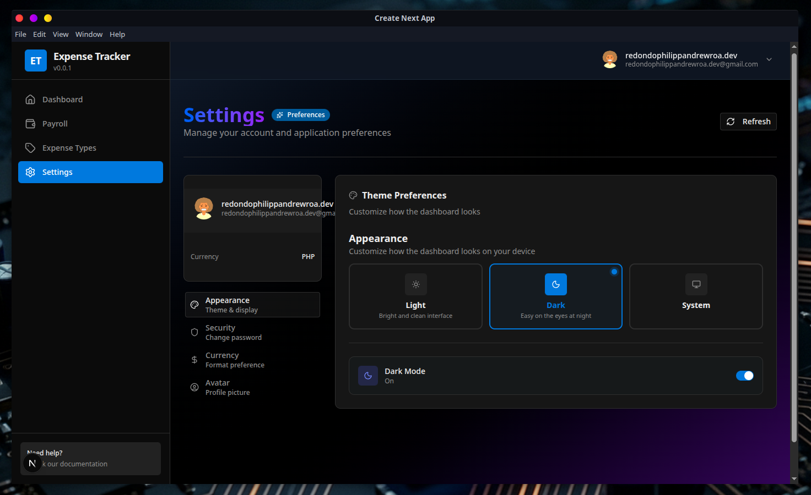
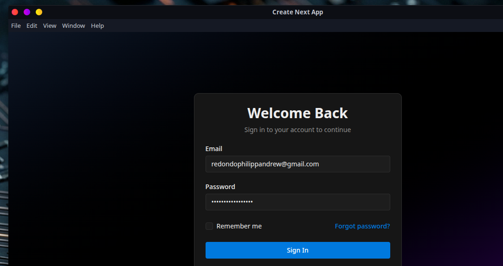
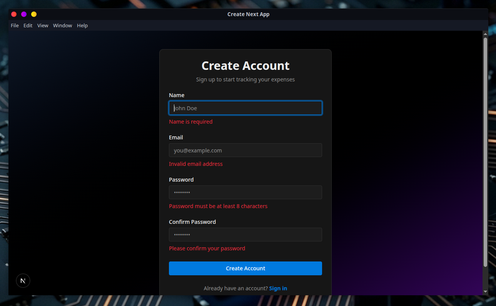

# 💰 Expense Tracker

A modern, cross-platform desktop application for managing personal finances, expenses, and payroll. Built with Electron and Next.js, this application combines the power of web technologies with native desktop capabilities.


## ✨ Features

### 💼 Payroll Management
- Create and manage monthly salary entries
- Track income across different time periods
- Budget allocation and monitoring
- Detailed payroll history with filtering capabilities

### 🧾 Expense Tracking
- Categorized expense management
- Custom expense categories (auto-create or manual)
- Quantity-based expense tracking
- Notes and additional details for each expense
- Due date tracking for pending payments

### 📊 Dashboard & Analytics
- Real-time expense overview
- Budget vs. actual spending visualization
- Category-wise expense breakdown
- Interactive charts and statistics

### 🔐 User Authentication
- Secure user registration and login
- Password hashing with bcrypt
- Session management with NextAuth.js
- Protected routes and API endpoints

### 🎨 Modern UI/UX
- Clean, intuitive interface built with Radix UI
- Dark/light theme support
- Responsive design with Tailwind CSS
- Smooth animations and transitions
- Accessible components following WAI-ARIA guidelines

## 📸 Screenshots

| Screenshot | Description |
|---|---|
|  | **Dashboard** — Real-time expense overview with budget vs. actual spending, category breakdown, and interactive charts powered by Recharts. |
|  | **Payroll Management** — Create and manage monthly salary entries, track income, and monitor budget allocation with detailed payroll history. |
|  | **Expense Categories** — Categorized expense management with custom categories, quantity-based tracking, due dates, and notes. |
|  | **Payroll Detail** — Detailed view of individual payroll entries with expense breakdown and budget utilization. |
|  | **Settings** — Password change, preferred currency configuration, and avatar/profile management. |
|  | **Login** — Secure authentication with NextAuth.js session management and bcrypt password hashing. |
|  | **Registration** — User registration with form validation powered by React Hook Form and Zod. |

## 🛠️ Tech Stack

### Frontend
- **Framework:** Next.js 16.0.1 (App Router)
- **UI Library:** React 19.2.0
- **UI Components:** Radix UI primitives
- **Styling:** Tailwind CSS 4.1.16
- **Charts:** Recharts
- **Forms:** React Hook Form + Zod validation
- **Icons:** Lucide React
- **Date Handling:** date-fns
- **Theming:** next-themes

### Backend
- **Desktop Framework:** Electron 39.0.0
- **API Routes:** Next.js API Routes
- **Authentication:** NextAuth.js
- **Database:** SQLite (local.db)
- **ORM:** Drizzle ORM
- **Password Hashing:** bcrypt

### Development Tools
- **Language:** TypeScript
- **Build Tool:** electron-builder
- **Database Management:** Drizzle Kit
- **Process Management:** Concurrently
- **Linting:** ESLint

## 📁 Project Structure

```
electron-nextjs-project/
├── app/                          # Next.js App Router
│   ├── (pages)/                  # Route groups
│   │   ├── auth/                 # Authentication pages
│   │   │   ├── login/           # Login page
│   │   │   └── signup/          # Sign up page
│   │   └── dashboard/           # Protected dashboard routes
│   │       ├── page.tsx         # Main dashboard
│   │       ├── layout.tsx       # Dashboard layout with sidebar
│   │       ├── payroll/         # Payroll management
│   │       │   ├── page.tsx     # Payroll list
│   │       │   └── [id]/        # Individual payroll details
│   │       └── expense-types/   # Expense categories
│   ├── api/                     # API Routes
│   │   ├── auth/                # Authentication endpoints
│   │   ├── expense/             # Expense CRUD operations
│   │   ├── expense-type/        # Category management
│   │   └── salary/              # Payroll operations
│   ├── layout.tsx               # Root layout
│   ├── page.tsx                 # Landing/home page
│   └── globals.css              # Global styles
├── components/                   # Reusable React components
│   ├── ui/                      # UI component library (Radix UI)
│   └── theme-provider.tsx       # Theme context provider
├── context/                      # React Context providers
│   ├── auth-context.tsx         # Authentication state
│   └── confirm-context.tsx      # Confirmation dialogs
├── db/                          # Database configuration
│   └── schema.ts                # Drizzle ORM schema definitions
├── drizzle/                     # Database migrations
├── hooks/                       # Custom React hooks
│   └── use-mobile.ts            # Mobile detection hook
├── lib/                         # Utility functions
├── main/                        # Electron main process
│   ├── main.js                  # Electron entry point
│   └── preload.js               # Preload script
├── models/                      # TypeScript models/types
│   ├── AuthSignup.ts            # Signup model
│   ├── Expense.ts               # Expense model
│   ├── ExpenseCategory.ts       # Category model
│   └── Payroll.ts               # Payroll model
├── navigation/                  # Navigation components
│   └── sidebar.component.tsx    # Dashboard sidebar
├── services/                    # Business logic layer
│   ├── expense.service.ts       # Expense operations
│   ├── expense-type.service.ts  # Category operations
│   ├── salary.service.ts        # Payroll operations
│   ├── user.service.ts          # User operations
│   ├── generic.service.ts       # Shared utilities
│   └── index.ts                 # Service exports
├── public/                      # Static assets
├── local.db                     # SQLite database file
├── drizzle.config.ts            # Drizzle Kit configuration
├── next.config.ts               # Next.js configuration
├── tsconfig.json                # TypeScript configuration
├── tailwind.config.js           # Tailwind CSS configuration
├── components.json              # shadcn/ui configuration
└── package.json                 # Dependencies and scripts
```

## 📊 Database Schema

### Users Table
- User authentication and profile information
- Fields: `id`, `name`, `email`, `passwordHash`

### Salary Table
- Monthly income/budget entries
- Fields: `id`, `month`, `year`, `day`, `title`, `totalBudget`, `userId`
- Relationships: Many-to-One with Users

### Expenses Category Table
- Custom expense categories
- Fields: `id`, `name`, `auto`, `active`, `userId`
- Auto-creation capability for expenses

### Expenses Table
- Individual expense records
- Fields: `id`, `title`, `amount`, `quantity`, `note`, `withDue`, `dueDate`, `expensesCategoryId`, `salaryId`
- Relationships: Many-to-One with Categories and Salary

## 🚀 Getting Started

### Prerequisites

Ensure you have the following installed:
- **Node.js** (v20 or higher)
- **npm** or **yarn** or **pnpm** or **bun**

### Installation

1. **Clone the repository:**
```bash
git clone <repository-url>
cd electron-nextjs-project
```

2. **Install dependencies:**
```bash
npm install
# or
yarn install
# or
pnpm install
# or
bun install
```

3. **Set up environment variables:**

Create a `.env` or `.env.local` file in the root directory:
```env
# Database
DB_FILE_NAME=./local.db

# NextAuth Configuration
NEXTAUTH_URL=http://localhost:3001
NEXTAUTH_SECRET=your-secret-key-here

# Node Environment
NODE_ENV=development
```

4. **Initialize the database:**
```bash
# Generate migrations
npx drizzle-kit generate

# Apply migrations
npx drizzle-kit migrate
```

## 🔧 Development

### Running the Development Server

Start both the Next.js development server and Electron app:

```bash
npm run dev
```

This command uses `concurrently` to run:
- **Next.js dev server** on `http://localhost:3001` (yellow console output)
- **Electron app** (blue console output)

The application will automatically:
- Open in an Electron window
- Enable hot module reloading
- Open DevTools for debugging

### Development Ports

- **Next.js Development Server:** `http://localhost:3001`
- **Production Mode:** `http://localhost:3000`

Note: The Electron main process is configured to use port 3001 in development mode.

## 🏗️ Building for Production

### Build the Application

```bash
npm run build
```

This command:
1. Creates an optimized Next.js production build
2. Packages the application with Electron Builder
3. Generates platform-specific installers

### Electron Builder Configuration

Add to `package.json` for custom build settings:

```json
{
  "build": {
    "appId": "com.expensetracker.app",
    "productName": "Expense Tracker",
    "directories": {
      "output": "dist"
    },
    "files": [
      "main/**/*",
      "out/**/*",
      "node_modules/**/*",
      "package.json"
    ],
    "win": {
      "target": ["nsis"]
    },
    "mac": {
      "target": ["dmg"]
    },
    "linux": {
      "target": ["AppImage", "deb"]
    }
  }
}
```

## 🗄️ Database Management

### Using Drizzle Kit

**Generate migrations after schema changes:**
```bash
npx drizzle-kit generate
```

**Apply migrations:**
```bash
npx drizzle-kit migrate
```

**Open Drizzle Studio (Database GUI):**
```bash
npx drizzle-kit studio
```

### Database Location
- **Development:** `./local.db` (SQLite file in project root)
- **Production:** Application data directory

## 🔌 API Routes

### Authentication
- `POST /api/auth/signup` - User registration
- `POST /api/auth/[...nextauth]` - NextAuth.js handlers
- `GET /api/auth/session` - Get current session

### Salary/Payroll
- `GET /api/salary` - List all payrolls
- `POST /api/salary` - Create new payroll
- `GET /api/salary/[id]` - Get payroll details
- `PUT /api/salary/[id]` - Update payroll
- `DELETE /api/salary/[id]` - Delete payroll
- `GET /api/salary/tiles` - Dashboard statistics

### Expenses
- `GET /api/expense` - List expenses (supports filtering by salaryId)
- `POST /api/expense` - Create expense
- `GET /api/expense/[id]` - Get expense details
- `PUT /api/expense/[id]` - Update expense
- `DELETE /api/expense/[id]` - Delete expense
- `GET /api/expense/salary/[id]` - Get expenses for specific payroll

### Expense Categories
- `GET /api/expense-type` - List all categories
- `POST /api/expense-type` - Create category
- `GET /api/expense-type/[id]` - Get category details
- `PUT /api/expense-type/[id]` - Update category
- `DELETE /api/expense-type/[id]` - Delete category

## 🎨 UI Components

This project uses a comprehensive UI component library built on:
- **Radix UI** - Unstyled, accessible components
- **Tailwind CSS** - Utility-first styling
- **shadcn/ui** - Component patterns

Available components include:
- Forms (Input, Select, Checkbox, Radio, etc.)
- Data Display (Tables, Cards, Charts)
- Feedback (Alerts, Dialogs, Toasts)
- Navigation (Sidebar, Breadcrumbs, Menus)
- Overlays (Modals, Popovers, Tooltips)

## 🔐 Security Features

- **Password Hashing:** bcrypt with salt rounds
- **Session Management:** Secure JWT tokens
- **CSRF Protection:** Built-in with NextAuth.js
- **Content Security Policy:** Configured in Electron
- **Context Isolation:** Enabled in Electron
- **SQL Injection Prevention:** Parameterized queries with Drizzle ORM

## 🧪 Development Tips

### Hot Reloading
Both Next.js and Electron support hot reloading:
- Frontend changes reload automatically
- Backend/API changes require server restart
- Electron main process changes require app restart

### Debugging
- **Frontend:** Use React DevTools in Electron window
- **Backend:** Console logs appear in terminal
- **Electron:** Main process logs in terminal, renderer in DevTools

### Code Quality
```bash
# Run linter
npm run lint

# Format code (if configured)
npm run format
```

## 📦 Key Dependencies Explained

- **electron-serve:** Serves Next.js production build in Electron
- **drizzle-orm:** Type-safe SQL query builder
- **next-auth:** Authentication for Next.js
- **react-hook-form:** Form state management
- **zod:** Schema validation
- **sonner:** Toast notifications
- **recharts:** Chart visualization
- **lucide-react:** Icon library

## 🤝 Contributing

### Development Workflow

1. Create a feature branch: `git checkout -b feature/your-feature`
2. Make your changes
3. Run linting: `npm run lint`
4. Test the application: `npm run dev`
5. Commit your changes: `git commit -m "feat: your feature"`
6. Push to branch: `git push origin feature/your-feature`
7. Open a Pull Request

### Commit Convention
Follow conventional commits:
- `feat:` New features
- `fix:` Bug fixes
- `docs:` Documentation changes
- `style:` Code style changes
- `refactor:` Code refactoring
- `test:` Test additions/changes
- `chore:` Build process or auxiliary tool changes

## 📄 License

This project is private and proprietary. All rights reserved.

## 🐛 Known Issues

- Development server runs on port 3001 (not the default 3000)
- Image optimization is disabled for Electron compatibility
- SQLite database is stored in project root (consider moving for production)

## 🔮 Future Enhancements

- [ ] Export functionality (CSV, PDF reports)
- [ ] Multi-currency support
- [ ] Recurring expenses
- [ ] Budget alerts and notifications
- [ ] Data backup and restore
- [ ] Advanced analytics and forecasting
- [ ] Receipt image attachments
- [ ] Cloud sync capabilities
- [ ] Mobile companion app

## 💬 Support

For questions, issues, or feature requests, please open an issue on the repository.

---

**Built with ❤️ using Electron, Next.js, and React**
